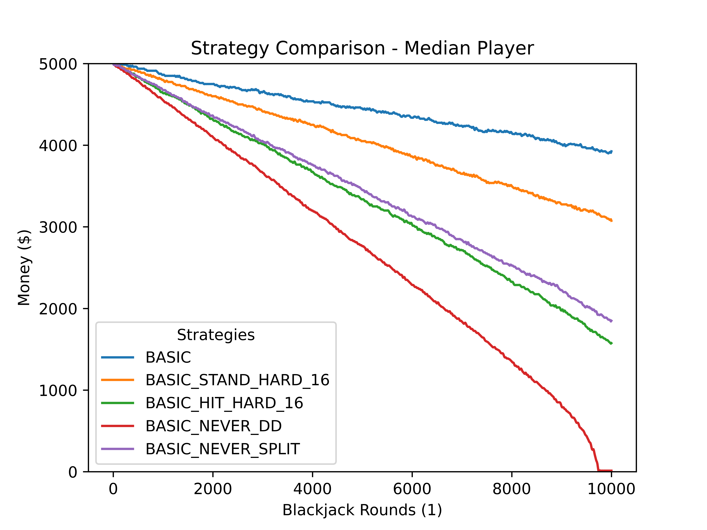
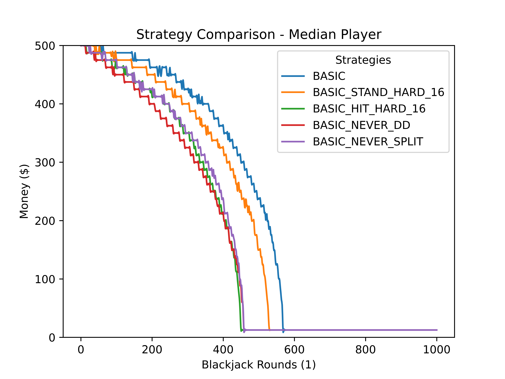

# Blackjack
 
Simulate blackjack for different table configurations and player strategies. Perhaps give your night at the casino a 
simulation before you go out. 

## 10,000 Lifetimes of Basic Strategy
You have roughly a 1/100 shot of playing a lifetime worth of $25 blackjack hands (100,000 rounds) and actually coming out 
ahead. Not great odds, but better than I would have guessed. 

## Other Interesting Takeaways
1) How slowly you lose money playing perfect basic strategy. 
2) How much quicker you lose money if you play basic strategy just a little wrong.
3) How much quicker you lose money if you are close to bankrupt, or don't bring a decent bankroll. 

Playing $25 hands, the loss rate is:
- Basic strategy:                     $0.155 per round
- Basic strategy, stand on hard 16:   $0.240 per round
- Basic strategy, never split:        $0.423 per round
- Basic strategy, hit on hard 16:     $0.417 per round
- Basic strategy, never double down:  $0.500 per round

Per $1 bet, that is a loss rate of:
- Basic strategy:                     $0.0062 per round
- Basic strategy, stand on hard 16:   $0.0096 per round
- Basic strategy, never split:        $0.0169 per round
- Basic strategy, hit on hard 16:     $0.0167 per round
- Basic strategy, never double down:  $0.0200 per round

Notice how the median player's money wicks down if they are close to zero. Can't recover once you are bankrupt. Bring enough money so that your loss rate stays low. 

