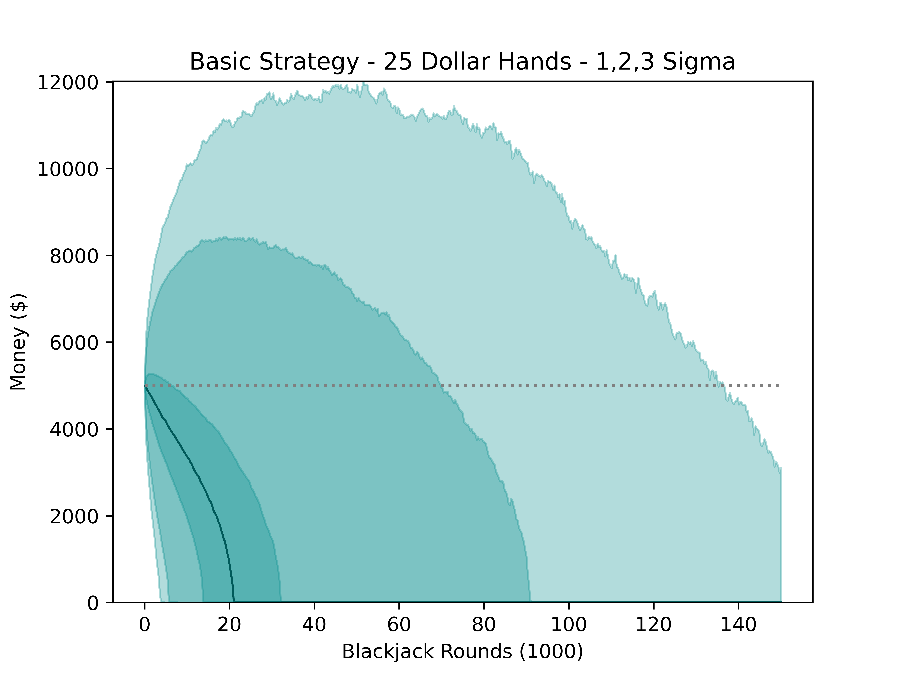

# Blackjack
 
Simulate blackjack for different table configurations and player strategies. Some interesting takeaways were:
1) How slowly you lose money playing perfect basic strategy. 
2) How quickly you lose money if you play basic strategy just a little bit wrong.

Notice how the median player's money wicks down if they are close to zero. Can't recover once you are bankrupt.

Playing $25 hands, the loss rate is:
- Basic strategy:                     $0.155 per round
- Basic strategy, stand on hard 16:   $0.24 per round
- Basic strategy, never split:        $0.423 per round
- Basic strategy, hit on hard 16:     $0.417 per round
- Basic strategy, never double down:  $0.500 per round
